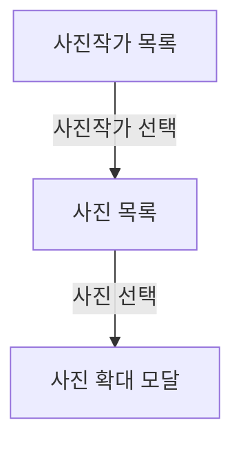

# Photographer Gallery

SwiftUI를 기반으로 네트워크 통신, 상태 관리, 화면 전환을 학습하기 위한 iOS 프로젝트입니다.

가상의 사용자를 앱 내부에서 **사진작가**로 표현하고, 사진작가를 선택하면 해당 사진작가가 촬영한 것으로 설정한 이미지 목록을 보여줍니다. 이미지를 선택하면 모달 화면에서 사진을 크게 확인할 수 있습니다.

> 현재 학습과 개발을 진행하고 있는 프로젝트입니다.

## 주요 기능

* 가상의 사진작가 목록 조회
* 사진작가 프로필 이미지와 기본 정보 표시
* 선택한 사진작가의 이미지 목록 조회
* `LazyVGrid`를 이용한 이미지 그리드 구성
* 선택한 이미지의 확대 모달 표시
* Coordinator를 이용한 화면 전환 관리
* 네트워크 요청의 로딩 및 오류 상태 처리

## 화면 흐름

## 화면 구성

| 화면       | 구현 기술               | 주요 역할               |
| -------- | ------------------- | ------------------- |
| 사진작가 목록  | SwiftUI             | 사진작가 프로필과 기본 정보 표시  |
| 사진 목록    | SwiftUI + LazyVGrid | 선택한 사진작가의 이미지 목록 표시 |
| 사진 확대 모달 | SwiftUI             | 선택한 이미지를 큰 크기로 표시   |

## 기술 스택

| 구분           | 기술          | 적용 내용                 |
| ------------ | ----------- | --------------------- |
| UI           | SwiftUI     | 전체 화면 및 이미지 그리드 구성    |
| Architecture | MVVM        | 화면 상태와 데이터 처리 로직 분리   |
| Navigation   | Coordinator | 화면 전환과 모달 표시 관리       |
| Network      | URLSession  | 외부 데이터 요청             |
| Reactive     | Combine     | 비동기 네트워크 결과와 화면 상태 연결 |
